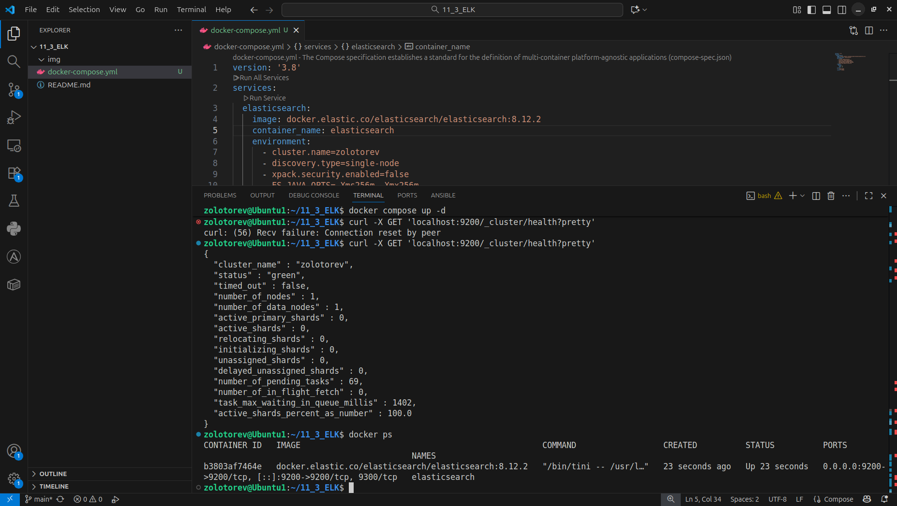
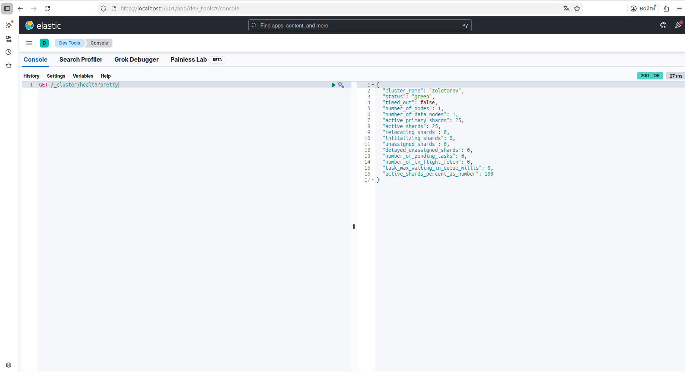

# 11_3_ELK

### Задание 1

Установите и запустите Elasticsearch, после чего поменяйте параметр cluster_name на случайный.

Приведите скриншот команды 'curl -X GET 'localhost:9200/_cluster/health?pretty', сделанной на сервере с установленным Elasticsearch. Где будет виден нестандартный cluster_name.

### Решение 1

### Задание 2

Установите и запустите Kibana.

Приведите скриншот интерфейса Kibana на странице http://<ip вашего сервера>:5601/app/dev_tools#/console, где будет выполнен запрос GET /_cluster/health?pretty.

### Решение 2

### Задание 3

Установите и запустите Logstash и Nginx. С помощью Logstash отправьте access-лог Nginx в Elasticsearch.

Приведите скриншот интерфейса Kibana, на котором видны логи Nginx.

### Решение 3

img src = "img/nginx_logs.png" width = 100%>

### Задание 4

Установите и запустите Filebeat. Переключите поставку логов Nginx с Logstash на Filebeat.

Приведите скриншот интерфейса Kibana, на котором видны логи Nginx, которые были отправлены через Filebeat.

### Решение 4

img src = "img/filebeat.png" width = 100%>